# SwiftBasket Quick Commerce — End-to-End Analytics Project

## Project Overview

**SwiftBasket** is a simulated Bengaluru-based hyperlocal grocery delivery business modelled after real-world players like Blinkit, Zepto, and Swiggy Instamart. The project covers **40 dark stores**, **23,119 orders**, **5,663 customers**, and **1.07 Cr revenue** across a 4-month period (Dec 2025 - Mar 2026).

This is a complete end-to-end analytics project built in two layers:

```
Raw Messy Data  ->  Data Audit  ->  Data Cleaning  ->  SQL Analysis  ->  Power BI Dashboard
```

The SQL layer handles all data quality work, cleaning, and business problem-solving. The Power BI layer translates those results into a 7-page interactive executive dashboard.

> The raw data was intentionally made messy to simulate real-world data engineering scenarios. All 13 data quality issues were identified, documented, and fixed using SQL Server 2022.

> **Live Dashboard:** [SwiftBasket Analytics Dashboard](https://app.powerbi.com/view?r=eyJrIjoiMWJiZjc3ZWUtYTBlMS00NTMwLTgxNjktZWI5ZDdkZjZkNzU0IiwidCI6IjU2MGY2MzA2LWZiZjItNGJhYy1hZTllLWQyMTQ4YzU5OTNiNyJ9)

---

## Business Problem

Quick commerce operates on razor-thin margins, high delivery SLA expectations, and extreme demand volatility driven by weather, festivals, and promotions. Without a structured analytics layer, dark store operators cannot answer questions like:

- Which stores are losing money and why?
- Where is inventory leaking revenue through stockouts?
- Which acquisition channels retain customers beyond month one?
- Are promotions driving real volume uplift or just margin giveaway?
- How does rain affect delivery SLA and what can be done about it?
- Which festivals drive the biggest demand spikes and are we ready for them?

This project answers all of these questions through SQL analysis and a Power BI dashboard built for business stakeholders.

---

## Dataset

| Property | Detail |
|---|---|
| **Business** | SwiftBasket - simulated hyperlocal grocery delivery |
| **Geography** | Bengaluru, across 5 zones (A-D + North/South/East) |
| **Period** | Dec 2025 - Mar 2026 (4 months) |
| **Stores** | 40 dark stores |
| **Total Rows** | 450,000+ across all tables |
| **Schema** | Star schema - 5 fact tables, 3 dimension tables, 1 calendar table |

### Data Dictionary

**`dim_customer` - Customer Master** (6,000 customers)

| Column | Type | Description | Example |
|---|---|---|---|
| `customer_id` | VARCHAR | Unique customer identifier | `CUST_0001` |
| `city` | VARCHAR | Customer's city | `Bengaluru` |
| `locality` | VARCHAR | Neighbourhood within city | `Koramangala` |
| `age_group` | VARCHAR | Age bracket of customer | `25-34` |
| `acquisition_channel` | VARCHAR | How customer was acquired | `Referral`, `Organic`, `Paid` |
| `signup_date` | DATE | Date customer registered | `2025-09-15` |
| `is_app_user` | BIT | 1 = mobile app user, 0 = web only | `1` |

**`dim_product` - Product Master** (40 SKUs across 8 categories)

| Column | Type | Description | Example |
|---|---|---|---|
| `product_id` | VARCHAR | Unique product identifier | `PROD_001` |
| `product_name` | VARCHAR | Full product name | `Amul Taza Milk 1L` |
| `category` | VARCHAR | Product category | `Dairy` |
| `base_price` | DECIMAL | Selling price in Rs | `62.00` |
| `is_perishable` | BIT | 1 = perishable item | `1` |
| `reorder_point_units` | INT | Minimum stock before reorder | `50` |

**`dim_store` - Store Master** (40 dark stores)

| Column | Type | Description | Example |
|---|---|---|---|
| `store_id` | VARCHAR | Unique store identifier | `STORE_01` |
| `store_name` | VARCHAR | Store name | `SwiftBasket Koramangala` |
| `zone` | VARCHAR | Bengaluru zone | `South`, `North`, `East` |
| `tier` | INT | Store tier number (1 = best) | `1` |
| `tier_label` | VARCHAR | Tier description | `Star`, `Good`, `Average`, `Struggling` |

**`fact_orders` - Order Lines** (~62,000 rows)

| Column | Type | Description | Example |
|---|---|---|---|
| `order_line_id` | VARCHAR | Unique identifier per order line | `OL_00001` |
| `order_id` | VARCHAR | Order identifier (groups lines) | `ORD_0001` |
| `order_ts` | DATETIME2 | Timestamp when order was placed | `2025-12-05 14:32:00` |
| `store_id` | VARCHAR | Store that fulfilled the order | `STORE_01` |
| `customer_id` | VARCHAR | Customer who placed the order | `CUST_0001` |
| `units` | INT | Quantity ordered | `2` |
| `effective_revenue` | DECIMAL | Actual revenue after discount in Rs | `117.80` |
| `order_status` | VARCHAR | Final order status | `delivered`, `cancelled` |
| `is_promo` | BIT | 1 = promo applied | `1` |
| `discount_pct` | DECIMAL | Discount percentage applied | `0.10` |

**`fact_delivery` - Delivery Records** (~21,000 rows)

| Column | Type | Description | Example |
|---|---|---|---|
| `delivery_id` | VARCHAR | Unique delivery identifier | `DEL_00001` |
| `order_id` | VARCHAR | Linked order | `ORD_0001` |
| `rider_id` | VARCHAR | Delivery rider identifier | `RIDER_01` |
| `promised_mins` | INT | SLA commitment in minutes | `30` |
| `actual_mins` | DECIMAL | Actual delivery time in minutes | `27.5` |
| `pick_pack_mins` | INT | Time to pick and pack at store | `8` |
| `distance_km` | DECIMAL | Delivery distance in km | `2.3` |
| `is_late` | BIT | 1 = breached SLA | `0` |
| `is_rainy` | BIT | 1 = rainy weather at delivery | `1` |

**`fact_inventory` - Daily Stock Levels** (~192,000 rows)

| Column | Type | Description | Example |
|---|---|---|---|
| `inventory_date` | DATE | Date of stock count | `2025-12-05` |
| `store_id` | VARCHAR | Store identifier | `STORE_01` |
| `product_id` | VARCHAR | Product identifier | `PROD_001` |
| `stock_on_hand` | INT | Units in stock at end of day | `145` |

**`fact_promotions` - Promotion Schedule** (~189,000 rows)

| Column | Type | Description | Example |
|---|---|---|---|
| `promo_date` | DATE | Date promotion is active | `2025-12-25` |
| `store_id` | VARCHAR | Store running the promo | `STORE_01` |
| `product_id` | VARCHAR | Product on promotion | `PROD_005` |
| `discount_pct` | DECIMAL | Discount percentage offered | `0.15` |

**`festival_calendar` - Indian Festival Calendar** (43 rows)

| Column | Type | Description | Example |
|---|---|---|---|
| `festival_date` | DATE | Calendar date | `2025-12-25` |
| `festival_name` | VARCHAR | Name of the festival | `Christmas` |
| `is_festival_window` | BIT | 1 = within 3 days of festival | `1` |
| `days_from_festival` | INT | -3 to +3 (0 = festival day itself) | `-2` |

---

## Project Objectives

- Audit and clean 450K+ rows of messy raw data using a structured Bronze to Silver to Gold architecture
- Solve 5 real business problems through multi-step SQL analysis
- Identify which stores, products, channels, and riders are underperforming and why
- Build a 7-page interactive Power BI dashboard for business stakeholders
- Surface actionable recommendations for inventory, delivery ops, promotions, and customer retention

---

## Tools & Technologies

| Tool | Purpose |
|---|---|
| **MS SQL Server 2022** | Database, data cleaning, business analysis |
| **SSMS 22** | Query execution and schema management |
| **Power BI Desktop** | Interactive 7-page dashboard |
| **DAX** | Calculated columns, measures, time intelligence, conditional logic |
| **Star Schema** | Data model - 5 fact tables, 3 dimension tables, 1 date table |
| **Git & GitHub** | Version control and project hosting |

---

## Project Workflow

```
Raw CSVs (8 files, 450K+ rows)
        |
        v
1. Schema Setup            -- Create raw.* and clean.* schemas, all tables
        |
        v
2. Data Audit              -- Identify all 13 data quality issues
        |
        v
3. Data Cleaning           -- Fix issues, load into clean.* schema
        |
        v
4. SQL Business Analysis   -- 5 business problems solved
        |
        v
5. Power BI Dashboard      -- 7-page interactive dashboard on clean.* data
        |
        v
6. Business Insights       -- Findings and recommendations per problem
```

---

## Architecture

```
raw.*  schema                    clean.*  schema
-------------                    ---------------
Original messy data         ->   Cleaned trusted data
Never modified                   Used for all analysis
Audit trail preserved            Query ready
```

This mirrors the **Medallion Architecture** used in industry:

| Industry Term | This Project | Purpose |
|---|---|---|
| Bronze Layer | `raw.*` schema | Store original data as-is |
| Silver Layer | `clean.*` schema | Cleaned, standardised data |
| Gold Layer | Analysis queries + Power BI | Business insights |

---

## SQL Analysis

**Files:**
- [`sql/01_create_schema.sql`](sql/01_create_schema.sql) - Creates raw + clean schemas and all tables
- [`sql/02_data_cleaning.sql`](sql/02_data_cleaning.sql) - Audits all issues and loads clean tables
- [`sql/03_analysis.sql`](sql/03_analysis.sql) - 5 business problem queries

---

### Data Quality Issues - Before & After

All 13 issues were identified in Section A of `02_data_cleaning.sql` and fixed in Section B.

| # | Table | Problem | Fix Applied |
|---|---|---|---|
| 1 | `dim_customer` | Mixed case - `referral` / `REFERRAL` / `Referral` | `UPPER(LTRIM(RTRIM(...)))` |
| 2 | `dim_customer` | NULL `city` for ~5% of customers | `COALESCE` with store city lookup |
| 3 | `dim_customer` | 150 duplicate customer rows | `ROW_NUMBER() PARTITION BY customer_id` |
| 4 | `fact_orders` | `discount_pct` stored as `'10%'` string | `REPLACE + CAST + CASE WHEN` |
| 5 | `fact_orders` | 200 duplicate `order_line_id` rows | `ROW_NUMBER() PARTITION BY order_line_id` |
| 6 | `fact_delivery` | Negative `actual_mins` values | `WHERE actual_mins >= 0` |
| 7 | `fact_delivery` | `pickup_ts` before `order_ts` - impossible timestamps | `WHERE pickup_ts >= order_ts` |
| 8 | `fact_delivery` | `is_rainy` stored as `'Yes'/'No'/'1'/'0'` mixed | `CASE WHEN UPPER(...)` |
| 9 | `fact_inventory` | Negative `stock_on_hand` values | `WHERE stock_on_hand >= 0` |
| 10 | `fact_inventory` | 500 duplicate rows same store + product + date | `GROUP BY ... MAX(stock_on_hand)` |
| 11 | `dim_product` | NULL `reorder_point_units` for 8 products | `COALESCE` with category median |
| 12 | `festival_calendar` | Mixed date formats `DD-MM-YYYY` vs `YYYY-MM-DD` | `SUBSTRING + CONVERT` |
| 13 | `festival_calendar` | Trailing spaces in `festival_name` | `LTRIM(RTRIM(...))` |

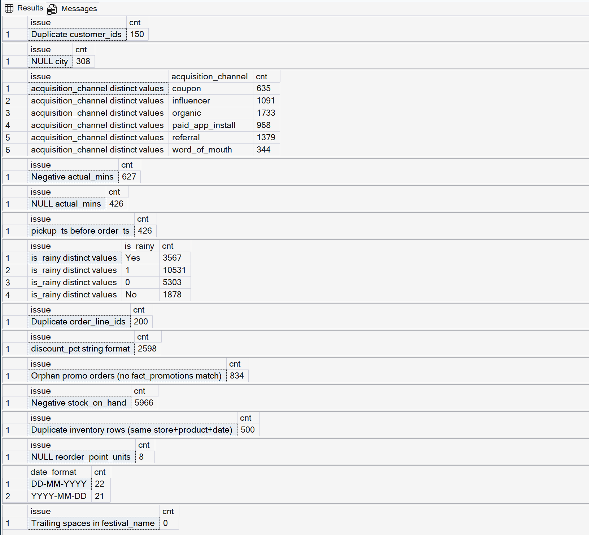

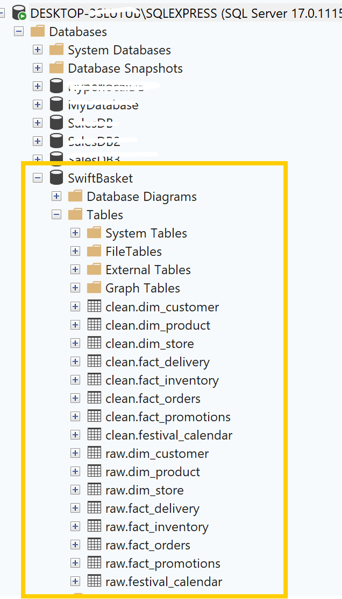

---

### Problem 1 - Customer Cohort & Retention

**Business Question:** Which acquisition channel retains customers the longest?

**SQL Approach:**
- Built monthly cohort - grouped customers by month of first order
- Tracked how many stayed active each subsequent month
- Calculated 3-month rolling retention rate per acquisition channel

**Key Insights:**
- Customer retention drops significantly in month 1 across all channels - from 100% to 47-68% - before stabilising around 49-63%
- Paid App Install achieved the best month-1 retention at 67.7% and best month-3 retention at 62.5% - app users have higher intent from the start
- Referral and Organic channels showed strong long-term retention (60.0% and 60.7% at month 3) and are the lowest-cost channels
- Organic + Referral together account for 52% of total revenue - the business is not dependent on paid marketing to sustain itself
- Influencer campaigns generated high acquisition volume but showed the steepest retention decline - customers attracted by a specific campaign rather than genuine product need
- Coupon-based acquisition showed the weakest retention overall, indicating discount-driven purchasing behaviour with no lasting loyalty

**Business Recommendations:**
- Focus retention effort on the first 30 days - that is where the highest churn occurs across every channel
- Increase investment in Paid App Install, Organic, and Referral - the three highest-retention channels
- Expand the referral program to drive scalable, low-cost acquisition
- Evaluate influencer campaigns at the creator level; scale only partnerships with strong month-2+ retention
- Replace coupon-based acquisition with loyalty-driven incentives to improve long-term value

**SQL Techniques:** Cohort analysis · Monthly retention calculation · Rolling retention rate · Multi-step CTE pipeline

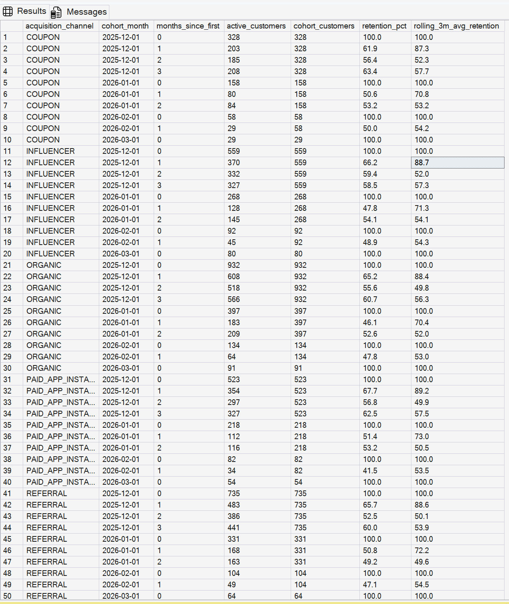

---

### Problem 2 - Delivery SLA & Rider Performance

**Business Question:** Which riders have the worst late delivery rate on rainy days?

**SQL Approach:**
- Calculated late delivery percentage per rider split by rainy vs dry days
- Filtered to riders with 10+ deliveries using `HAVING`
- Ranked worst 5 riders per store using `RANK() PARTITION BY store_id`
- Flagged root cause: distance vs operational issue

**Key Insights:**
- Overall on-time rate of 34.5% against an industry benchmark of 85%+ - the business is operating at less than half the industry standard
- 100% of riders experienced SLA breaches on rainy days - this is a systemic operational issue, not an individual rider performance issue
- Delivery distance is NOT the cause - average delivery distance is only 1.4-2.7 km across all stores
- Pick-pack times remained consistent at 4-6 minutes across all stores - order preparation is not causing the delays
- S003 (Whitefield) showed the poorest performance - rider R048 averaging 52.9 minutes per delivery despite only 2.66 km distance
- S002 (Koramangala) had 6 riders with 100% late-delivery rates, suggesting a store-level dispatch or handoff bottleneck
- Rain drops on-time rate from 99% to just 2-6% across all tiers - a 95 percentage point collapse

**Business Recommendations:**
- Implement a weather-adjusted SLA that automatically extends promised delivery time when `is_rainy = 1`
- Investigate S003 (Whitefield) dispatch and rider allocation processes - the problem is operational, not geographic
- Conduct a process audit at S002 (Koramangala) to uncover handoff bottlenecks
- Separate weather-related delays from standard SLA reporting to get a true view of operational performance
- Standardise best practices from better-performing riders across the fleet

**SQL Techniques:** Conditional aggregation · `HAVING` filter · `RANK() OVER (PARTITION BY)` · Weather segmentation

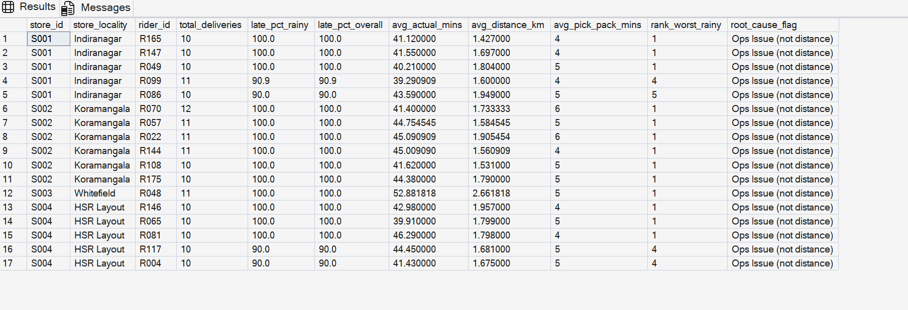

---

### Problem 3 - Promo Effectiveness & Margin Impact

**Business Question:** Which promotions drove real volume uplift vs just margin giveaway?

**SQL Approach:**
- Compared promo vs non-promo sales baseline per product
- Calculated ROI = gross margin earned divided by discount given
- Detected orphan orders using `LEFT JOIN` null check
- Classified promotions as Star Promo / Volume Only / Efficient / Poor ROI

**Key Insights:**
- Most promotions fell into Efficient or Poor ROI categories - many campaigns generated limited volume growth or unprofitable returns
- Star Promos were rare but highly effective - Butter 100g, Breakfast Cereal, and Biscuits Pack achieved both strong ROI and significant volume uplift
- Core stores (S001-S004) consistently delivered higher promotional ROI; peripheral stores (S018-S040) frequently showed low or negative returns
- Beverage and staple categories generated high promotional activity but limited incremental sales - potential discount leakage
- Protein products (Chicken, Eggs) frequently produced low ROI and margin erosion, particularly in lower-volume stores
- Struggling stores run a 24.2% promo rate with 35% average discount vs Star at 6.9% with 10% discount - more promos and deeper discounts do not translate to better results when underlying ops are broken

**Business Recommendations:**
- Scale high-performing Star Promos across similar stores and product categories
- Establish a minimum ROI threshold (e.g., 2x) before approving promotional campaigns
- Reduce or redesign promotions in stores with consistently low ROI
- Replace blanket discounts with bundling and loyalty-based offers, especially for beverages and staples
- Limit deep discounting on high-cost protein products in low-volume stores

**SQL Techniques:** Multi-CTE pipeline · `LEFT JOIN` orphan detection · ROI formula · Promotional classification

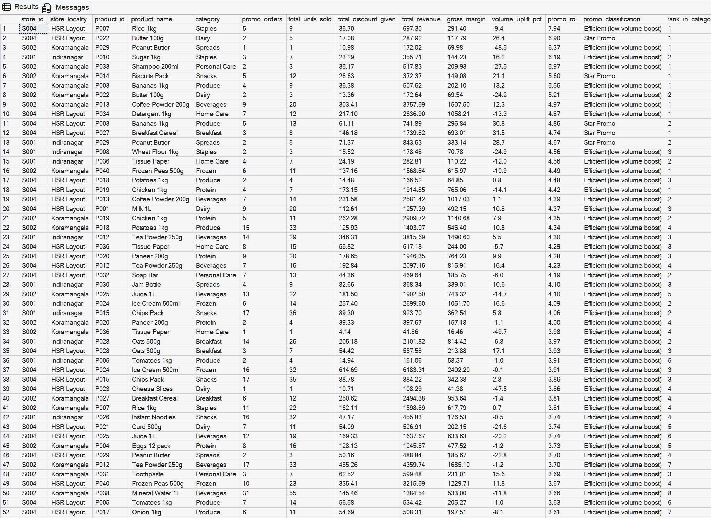

---

### Problem 4 - Inventory Stockout Risk

**Business Question:** Which store-product combinations will stock out within 5 days?

**SQL Approach:**
- Calculated average daily sales velocity over the last 30 days per store-product
- Retrieved latest stock snapshot using `ROW_NUMBER()` on inventory date
- Compared current stock vs reorder point per product
- Generated risk tiers (Stockout / Critical / High Risk / Reorder / Review / OK) and recommended reorder quantities

**Key Insights:**
- Stockout risk is heavily concentrated in Struggling-tier stores - several locations experiencing multiple simultaneous stockouts across essential products
- Over 80 products classified as Stockout or Critical (2 days remaining or fewer) - this is systemic, not isolated
- Perishable products - Milk, Eggs, Butter, Bananas, Curd - account for a significant share of stockouts, increasing risk of lost sales and customer dissatisfaction
- More than 40 store-product combinations had missing sales history (`avg_daily_units_sold = NULL`), preventing accurate demand forecasting
- Star-performing stores generally maintained healthy inventory levels, though a few high-demand products need proactive monitoring
- Rs 17.3L stockout leakage at 4.8% stockout rate - nearly Rs 1 in every Rs 20 of potential revenue is being lost to unavailability

**Business Recommendations:**
- Prioritise emergency replenishment for stores with multiple critical stockouts, focusing first on perishables
- Resolve missing sales data for 40+ store-product combinations to enable accurate demand forecasting
- Implement more frequent replenishment cycles for Struggling stores, particularly for perishable items
- Restrict promotional campaigns on products or stores experiencing active stockouts
- Review low-volume SKUs in underperforming stores and consider assortment optimisation

**SQL Techniques:** Sales velocity calculation · `ROW_NUMBER()` latest snapshot · Risk tier `CASE WHEN` · Reorder quantity logic

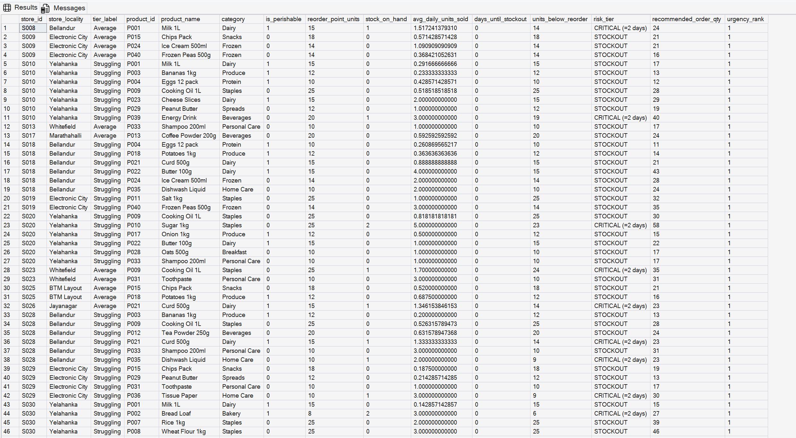

---

### Problem 5 - Festival Demand Spike

**Business Question:** Which categories spike most before festivals and are we prepared?

**SQL Approach:**
- Tagged each order date with festival context via a range join on the festival calendar
- Calculated spike percentage vs normal daily baseline per category
- Ranked categories by spike magnitude per festival using `RANK() PARTITION BY festival_name`

**Key Insights:**
- Festival demand is +78% above normal days on average - orders nearly double during pre-festival windows
- Republic Day is the most intense demand event - Protein +137%, Dairy +133%, Personal Care +129%, Snacks +127%. It is the most underestimated festival because it is not traditionally seen as a shopping event
- Frozen category is the most consistent festival performer - ranks in the top 2 spike categories across Christmas, Holi, Makar Sankranti, Valentine's Day, and Ugadi
- Ugadi and Makar Sankranti spike hardest overall - South Indian and pan-Indian festival calendars need to be built into the replenishment model 5-7 days in advance
- Beverages maintained the highest revenue share across most festivals - the most critical category for revenue protection during peak periods
- Bakery emerged as an unexpectedly high-growth category across multiple festivals - underappreciated demand potential
- Despite predictable demand patterns, inventory data shows stockouts during these same periods - planning is not aligned with known spikes

**Business Recommendations:**
- Build festival-specific inventory plans using historical demand multipliers and maintain additional safety stock for high-spike categories
- Prioritise Protein, Frozen, and Beverages for pre-festival replenishment
- Increase allocation 5-7 days before Republic Day, Makar Sankranti, Holi, and Ugadi - the strongest demand events
- Avoid running promotions on categories already experiencing strong organic festival demand to protect margins
- Use historical festival data to secure supplier inventory commitments ahead of peak periods

**SQL Techniques:** Range join on festival calendar · `RANK() PARTITION BY festival_name` · Percentage-of-total window function · Demand spike calculation

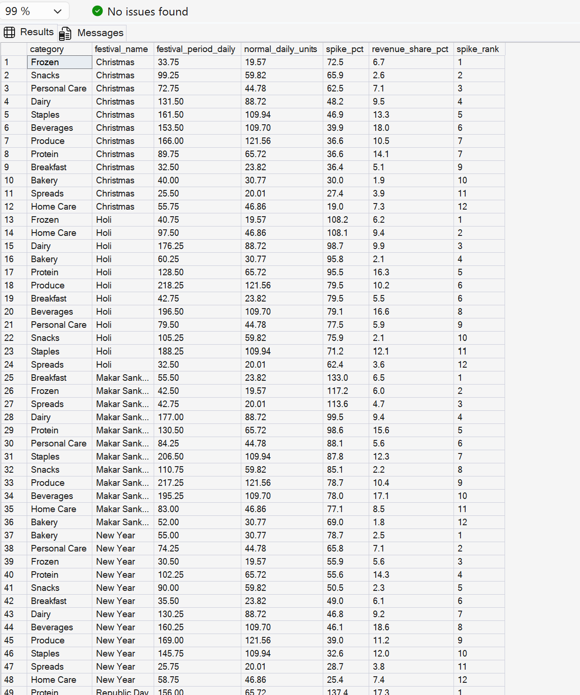

---

## Power BI Dashboard

**File:** [`PowerBI/SwiftBasket_Dashboard.pbix`](PowerBI/SwiftBasket_Dashboard.pbix)

**Live Link:** [View Dashboard](https://app.powerbi.com/view?r=eyJrIjoiMWJiZjc3ZWUtYTBlMS00NTMwLTgxNjktZWI5ZDdkZjZkNzU0IiwidCI6IjU2MGY2MzA2LWZiZjItNGJhYy1hZTllLWQyMTQ4YzU5OTNiNyJ9)

The dashboard is built directly on the `clean.*` SQL schema and spans 7 pages with a branded navigation panel and cross-page slicers.

### Interactive Filters (applied across all 7 pages)

| Filter | Options |
|---|---|
| **Tier** | Star · Good · Average · Struggling |
| **Channel** | App · Web |
| **Zone** | Zone A · Zone B · Zone C · Zone D |
| **Order Status** | Delivered · Cancelled |

---

### Page 1 - Overview

**Business Question:** How is the overall business performing?

**KPI Cards:** Revenue · Gross Profit · Total Orders · Cancellation Rate · Stockout Leakage

**Visuals:**
- Effective Revenue 7-day rolling average (Star+Good vs Average+Struggling)
- Revenue share by tier - donut chart
- Orders by hour of day - bar chart
- Orders by day of week - bar chart
- Order status funnel

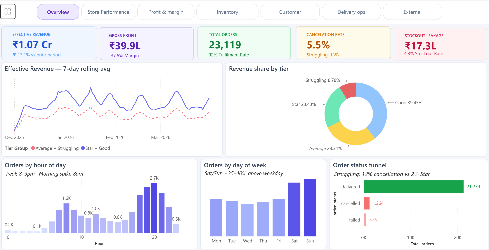

**Key Insights:**
- Rs 1.07 Cr revenue with a -13.1% decline vs prior period - the business is shrinking, not growing
- Good tier generates 39.45% of revenue despite not being the top tier - the backbone of the business
- Star stores (only 3 stores) contribute 23.43% - impressive per-store output but limited scale
- Struggling stores generate only 8.78% of revenue despite being the largest group - a drag on overall performance
- Peak demand is 8-9pm with a morning spike at 8am - staffing and inventory readiness should be optimised around these two windows
- Saturday and Sunday are 35-40% above weekday volumes - weekend stock pre-positioning is critical
- Rs 17.3L stockout leakage at 4.8% stockout rate - nearly Rs 1 in every Rs 20 of potential revenue lost to unavailability
- Struggling stores: 13% cancellation rate vs overall 5.5% - more than double the average

---

### Page 2 - Store Performance

**Business Question:** Which stores are winning and which are struggling - and why?

**Visuals:**
- KPI cards - average revenue per store by tier
- All 40 stores ranked by delivered revenue (horizontal bar)
- Order fulfilment rate by tier
- Store scorecard table - all 40 stores with revenue, margin, fulfilment rate, stockout rate


**Key Insights:**
- Star stores avg Rs 8.3L vs Struggling Rs 66.8K - a 12.5x revenue gap
- Top 3 stores are all Zone A locations (Koramangala, HSR Layout, Indiranagar) - but the gap is not purely geographic; Good tier stores in the same areas perform significantly lower
- Fulfilment rate drops from 97% (Star) to 82% (Struggling) - 1 in 6 Struggling store orders cannot be completed
- Average tier stores cluster around Rs 1.8L-Rs 2.9L with consistent 33-34% gross margins - stable but not growing. Small operational improvements could move several into the Good tier
- Struggling stores show stockout rates of 10-12% - nearly three times the Star store rate of ~0.3%

---

### Page 3 - Profit & Margin

**Business Question:** Where is margin being made and where is it being eroded?

**Visuals:**
- Effective Revenue and Gross Profit by tier - clustered bar
- Gross Margin % by tier - bar chart
- Gross Margin % by category - horizontal bar
- Gross Margin % trend over time by tier - line chart

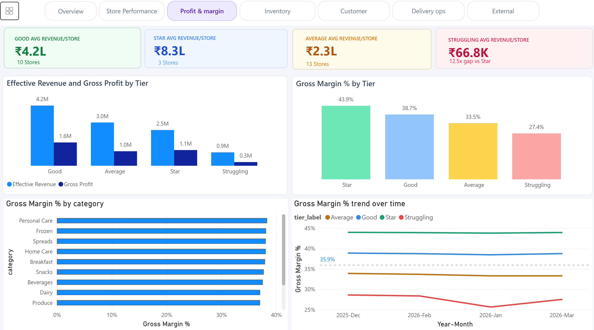

**Key Insights:**
- Star tier achieves 43.9% gross margin vs Struggling at 27.4% - a 16.5 percentage point gap on the same products and pricing
- Good tier generates the highest absolute gross profit (Rs 1.6M) despite Star having better per-store margins - because Good has more stores and more volume
- Gross margin is almost flat across all categories (37-38%) - formulaic pricing rather than strategic differentiation. Opportunity to increase margins on high-demand, low-substitution categories
- Struggling tier margin is actively declining - from 29% in Dec 2025 to 25% by Mar 2026. These stores will become loss-making if unchecked
- Star and Good tier margins are flat over 4 months - the decline is isolated to Struggling stores, not a business-wide pricing issue

---

### Page 4 - Inventory

**Business Question:** Which products are at risk of stocking out and how much revenue is being lost?

**Visuals:**
- KPI cards - Revenue · Gross Profit · Total Orders · Cancellation Rate · Stockout Leakage
- Inventory Risk table - store x product level with Risk Tier colour coding
- Lost Revenue by product - horizontal bar

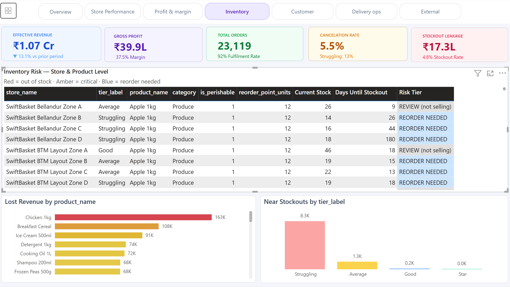

**Key Insights:**
- Chicken 1kg is the single highest lost-revenue product at Rs 163K - requires daily replenishment
- Over 80 store-product combinations classified as Stockout or Critical
- Perishable items (Milk, Eggs, Butter, Bananas, Curd) account for the majority of stockout events
- Struggling stores are responsible for the bulk of stockout leakage - inventory failure, not demand failure

---

### Page 5 - Customer & Retention

**Business Question:** Which channels acquire the most valuable long-term customers?

**Visuals:**
- Cohort retention chart by acquisition channel
- Revenue share by acquisition channel
- Customer distribution by age group

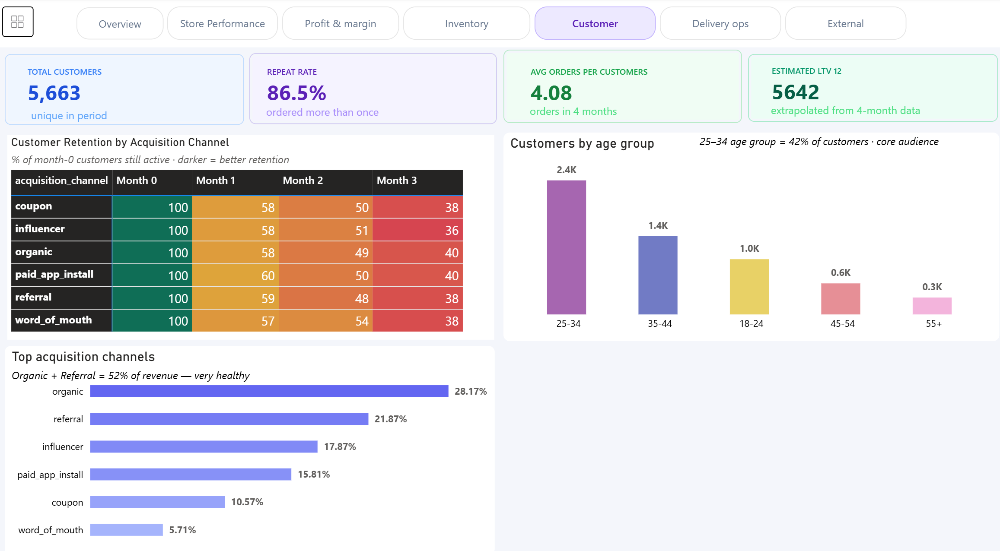

**Key Insights:**
- All channels lose 40-60% of customers by month 3 - the first 30 days is the critical retention window
- Paid App Install has the best month-1 retention at 60% - app users have higher intent and engagement from the start
- Influencer channel has the worst month-3 retention at 36% - attracted by campaign, not product
- Organic + Referral = 52% of revenue - the business is not dependent on paid marketing
- 25-34 age group = 42% of customers - all strategy should be optimised for this cohort first

---

### Page 6 - Delivery Ops

**Business Question:** Are we delivering on time and what is causing delays?

**Visuals:**
- KPI cards - On-Time Rate · Avg Actual Delivery · Avg Pick & Pack · Avg Distance KM
- Actual vs promised delivery by tier - clustered bar
- On-time rate by store - horizontal bar
- On-Time Delivery Rate: Normal vs Rainy Days - clustered bar
- Avg Delivery Time: Normal vs Rainy Days - clustered bar

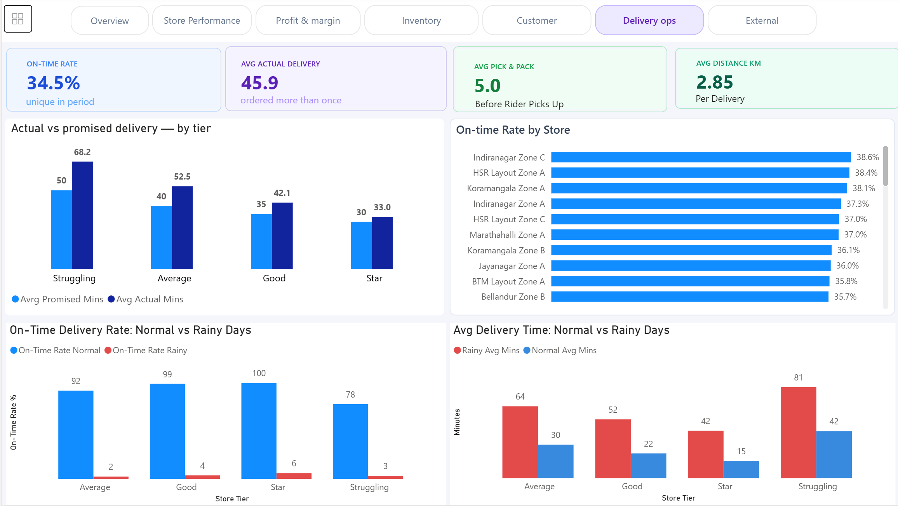

**Key Insights:**
- Overall on-time rate of 34.5% against an industry benchmark of 85%+ - less than half the standard
- Struggling stores promise 50 minutes but deliver in 68 minutes on average - an 18-minute gap. Star stores promise 30 minutes and deliver in 33 - a 3-minute gap
- Best-performing store (Indiranagar Zone C) achieves only 38.6% on-time rate - the problem is systemic, not store-level
- Rain drops on-time rate from 99% to just 2-6% across all tiers - a 95 percentage point collapse
- Average delivery distance is only 2.85km - distance is not the cause. Rain causes pick-pack handoff delays and rider slowdowns
- Rain adds 27-39 minutes to delivery time across all tiers - a weather-adjusted SLA would immediately improve the metric without changing actual speed

---

### Page 7 - External Factors

**Business Question:** How do festivals, weather, and promotions affect demand and performance?

**Visuals:**
- KPI cards - Festival Demand Lift · Rainy Day Order Drop · Star Promo Rate · Struggling Promo Rate
- Festival Demand Spike heatmap (12 categories x 7 festivals)
- Festival lift by category - horizontal bar
- Promo rate vs discount depth - scatter plot

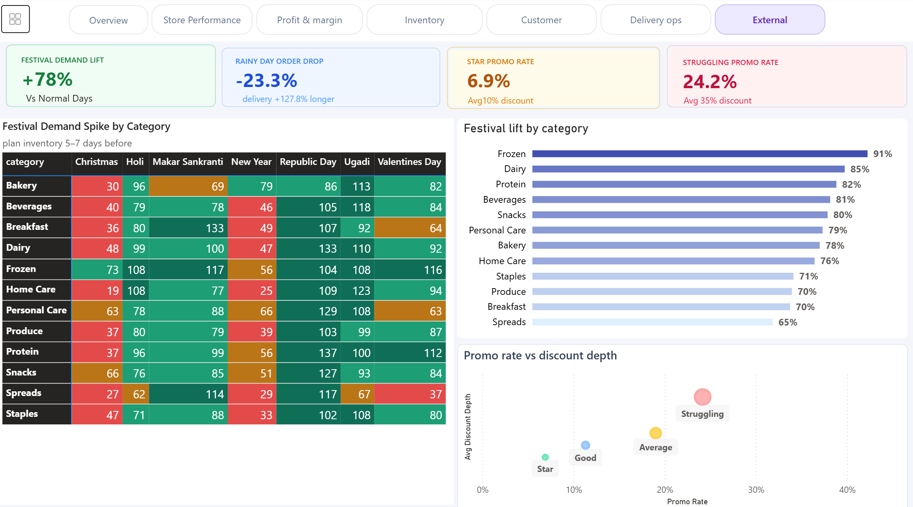

**Key Insights:**
- Festival demand is +78% above normal days on average - predictable and plannable, yet inventory shows stockouts during these same periods
- Republic Day is the most intense demand event - Protein +137%, Dairy +133%, Personal Care +129%
- Frozen category ranks in the top 2 spike categories across 5 of 7 festivals - pre-festival Frozen stock builds are non-negotiable
- Ugadi and Makar Sankranti spike hardest overall - need to build inventory 5-7 days in advance
- Rainy days cause a -23.3% drop in orders AND delivery is 127.8% longer - demand and supply both degrade simultaneously
- Struggling stores run a 24.2% promo rate with 35% average discount vs Star at 6.9% with 10% discount - more promos and deeper discounts do not translate to better results when ops are broken

---

## Key DAX Measures

| Measure | Purpose |
|---|---|
| `Retention %` | % of month-0 cohort still active each subsequent month |
| `Cohort Month` | Assigns each customer their first order month |
| `Month Offset` | Months elapsed since first order |
| `Days Until Stockout` | Current stock divided by 30-day sales velocity |
| `Risk Tier` | STOCKOUT / CRITICAL / HIGH RISK / REORDER / REVIEW / OK |
| `Current Stock` | Latest stock snapshot per store-product |
| `Is Latest Date` | Flags most recent inventory row per store-product |
| `On-Time Rate Normal` | On-time % on non-rainy days |
| `On-Time Rate Rainy` | On-time % on rainy days only |
| `Avg Mins Normal` | Average delivery minutes on dry days |
| `Avg Mins Rainy` | Average delivery minutes on rainy days |
| `Gross Margin % by Tier` | (Revenue minus COGS) divided by Revenue x 100 |

---

## Key Findings Summary

| Area | Finding | Impact |
|---|---|---|
| Overview | Revenue down 13.1% vs prior period | Urgent business health concern |
| Overview | Rs 17.3L lost to stockouts (4.8% rate) | Recoverable with better inventory planning |
| Store Performance | 12.5x revenue gap - Star vs Struggling | Ops quality gap, not location gap |
| Profit & Margin | Struggling margin declining 29% to 25% | Stores becoming loss-making |
| Inventory | Chicken 1kg = Rs 163K lost revenue | Daily replenishment required |
| Customer | All channels lose 40-60% by month 3 | First 30 days is the critical retention window |
| Delivery Ops | Rain drops on-time rate from 99% to 4% | Weather-adjusted SLA needed immediately |
| External Factors | Republic Day most underplanned event | Pre-stock all categories 7 days before |
| Promotions | Struggling stores discount 3.5x more than Star | Promos cannot fix broken ops |
| Retention | Organic + Referral = 52% of revenue | Lowest-cost channels have highest value |

---

## Business Recommendations

**Inventory & Stockout**
- Implement daily replenishment for perishables in Struggling stores - Milk, Eggs, Butter, Chicken account for the majority of the Rs 17.3L stockout loss
- Build festival-specific inventory plans using demand multipliers from historical data - Republic Day, Makar Sankranti, and Ugadi need stock pre-positioned 5-7 days in advance
- Restrict promotional campaigns on any product or store currently experiencing active stockouts

**Delivery Operations**
- Introduce a weather-adjusted SLA - when `is_rainy = 1`, automatically extend the promised delivery window. This improves the on-time metric without changing actual delivery speed
- Investigate S003 (Whitefield) and S002 (Koramangala) for dispatch and handoff bottlenecks - the problem is operational, not rider-level

**Store Performance**
- Treat the 28 Average and Struggling stores as the primary growth opportunity - not the 3 Star stores. Small operational improvements in fulfilment rate and stockout rate in Average stores could move several into the Good tier
- Do not use deeper discounts to fix Struggling stores - the scatter plot confirms promos are not the problem or the solution

**Customer Retention**
- Focus all retention investment on the first 30 days - that is where the highest churn occurs across every channel
- Scale Paid App Install, Organic, and Referral acquisition - highest retention, lowest long-term cost
- Reassess influencer campaigns - measure month-3 retention, not just acquisition volume

**Promotions**
- Set a minimum ROI threshold (2x) before approving any promotional campaign
- Replace blanket discounts with bundling and loyalty-based offers, especially for beverages and staples

---

## Challenges Faced

**Messy Raw Data**
The raw data contained 13 deliberate data quality issues across 6 tables - mixed case values, impossible timestamps, negative numeric values, duplicate rows, mixed date formats, and NULL values with no clear fill strategy. Each issue required a different SQL fix and was documented before being resolved to preserve a clean audit trail.

**Dual Schema Architecture**
Maintaining a `raw.*` and `clean.*` schema separation required careful planning to ensure analysis queries always ran on clean data while the original raw data remained untouched for audit purposes.

**Weather Impact on SLA**
The on-time delivery analysis required splitting every metric by `is_rainy` flag to separate weather-driven failures from genuine operational failures - otherwise the 95-point drop in on-time rate during rain would have buried all other performance signals.

**Festival Range Join**
Joining order dates to the festival calendar required a range join (matching order dates within a 3-day window of each festival) rather than a direct date match - a non-trivial SQL pattern that needed careful handling to avoid row multiplication.

---

## Future Enhancements

- **Predictive Stockout Alerts** - Build a stockout prediction model using 30-day sales velocity and current stock levels, triggering automated reorder recommendations before the Critical threshold is reached
- **Rider Performance Scoring** - Develop a composite rider score combining on-time rate (dry days), on-time rate (rainy days), average delivery time, and distance efficiency
- **Real-Time Dashboard** - Connect Power BI to a live SQL database via DirectQuery to enable real-time monitoring of stockouts, cancellations, and SLA breaches
- **Cohort Expansion** - Extend cohort analysis beyond 3 months and include revenue per customer by cohort - identifying which channels retain high-value customers, not just any customers
- **Festival Pre-Positioning Model** - Build a demand multiplier model per festival x category x zone to generate specific pre-festival stock recommendations automatically for each store

---

## How to Run This Project

**Prerequisites:** SQL Server 2022 · SSMS 22 · Power BI Desktop ([download free](https://powerbi.microsoft.com))

### Step 1 - Clone the Repository
```bash
git clone https://github.com/yourusername/swiftbasket-analytics.git
cd swiftbasket-analytics
```

### Step 2 - Run the SQL Scripts (in order)
```
1. Run sql/01_create_schema.sql    ->  creates database, raw.* and clean.* schemas, all tables
2. Load CSVs via BULK INSERT       ->  populates raw.* tables from data/raw/ folder
3. Run sql/02_data_cleaning.sql    ->  Section A (audit all 13 issues), Section B (fix and load clean.*)
4. Run sql/03_analysis.sql         ->  run one problem at a time, top to bottom
```

> Always run scripts in this order. Analysis queries depend on the clean schema being populated first.

### Step 3 - Open the Power BI Dashboard
1. Open Power BI Desktop
2. Open `PowerBI/SwiftBasket_Dashboard.pbix`
3. If prompted to refresh data, reconnect to your local SQL Server instance pointing to the `clean.*` schema
4. Use the navigation buttons at the top to move between pages
5. Use the filter panel (top-left grid icon) to filter by Tier, Channel, Zone, or Order Status

---

## Project Structure

```
swiftbasket-analytics/
|
+-- data/
|   +-- raw/                             <- 8 messy CSV source files
|       +-- dim_customer.csv
|       +-- dim_product.csv
|       +-- dim_store.csv
|       +-- fact_orders.csv
|       +-- fact_delivery.csv
|       +-- fact_inventory.csv
|       +-- fact_promotions.csv
|       +-- festival_calendar.csv
|
+-- sql/
|   +-- 01_create_schema.sql             <- Creates raw + clean schemas & tables
|   +-- 02_data_cleaning.sql             <- Audits 13 issues + loads clean tables
|   +-- 03_analysis.sql                  <- 5 business problem queries
|
+-- PowerBI/
|   +-- SwiftBasket_Dashboard.pbix       <- 7-page interactive dashboard
|
+-- Screenshots/
|   +-- audit_results.png                <- SQL audit output
|   +-- schema_structure.png             <- Database schema diagram
|   +-- problem1_retention.png           <- SQL Problem 1 output
|   +-- problem2_delivery.png            <- SQL Problem 2 output
|   +-- problem3_promo.png               <- SQL Problem 3 output
|   +-- problem4_inventory.png           <- SQL Problem 4 output
|   +-- problem5_festival.png            <- SQL Problem 5 output
|   +-- PBI_page1_overview.png           <- Dashboard Page 1
|   +-- PBI_page2_store_performance.png  <- Dashboard Page 2
|   +-- PBI_page3_margin.png             <- Dashboard Page 3
|   +-- PBI_page4_inventory.png          <- Dashboard Page 4
|   +-- PBI_page5_customer.png           <- Dashboard Page 5
|   +-- PBI_page6_delivery.png           <- Dashboard Page 6
|   +-- PBI_page7_external.png           <- Dashboard Page 7
|
+-- README.md
```

---

## Skills Demonstrated

| Skill | Detail |
|---|---|
| **SQL Data Cleaning** | Identified and fixed 13 data quality issues across 6 tables using deduplication, imputation, type casting, and string normalisation |
| **Schema Architecture** | Implemented Bronze to Silver to Gold medallion architecture using dual `raw.*` and `clean.*` schemas |
| **SQL Business Analysis** | Solved 5 business problems using cohort analysis, window functions, range joins, multi-CTE pipelines, and conditional aggregation |
| **Window Functions** | `ROW_NUMBER()`, `RANK() OVER (PARTITION BY)`, `AVG OVER`, running totals, `NTILE()` |
| **DAX & Data Modelling** | Built 12+ DAX measures covering retention, inventory risk, weather-adjusted delivery, and margin analysis on a star schema |
| **Power BI Dashboard Development** | 7-page interactive dashboard with KPI cards, heat maps, scatter plots, cohort charts, scorecard tables, and cross-page slicers |
| **Business Storytelling** | Translated SQL outputs into plain-English insights and actionable recommendations for each business problem |
| **Insight Generation** | Identified non-obvious signals: rain as a systemic SLA failure driver, Republic Day as the most underplanned festival, promo depth having no correlation with revenue in Struggling stores |

---

## Author

**Srividya Achar** - Transitioning into data analytics from 8 years in IT operations at TCS and Wipro.

Email: SrividyaAchar@outlook.com

[LinkedIn](https://linkedin.com/in/srividya-achar) · [Credit Risk Analysis Project](../credit-risk-analysis)

---
*SQL Server 2022 · SSMS 22 · Power BI · DAX · Quick Commerce Analytics · Bengaluru*
